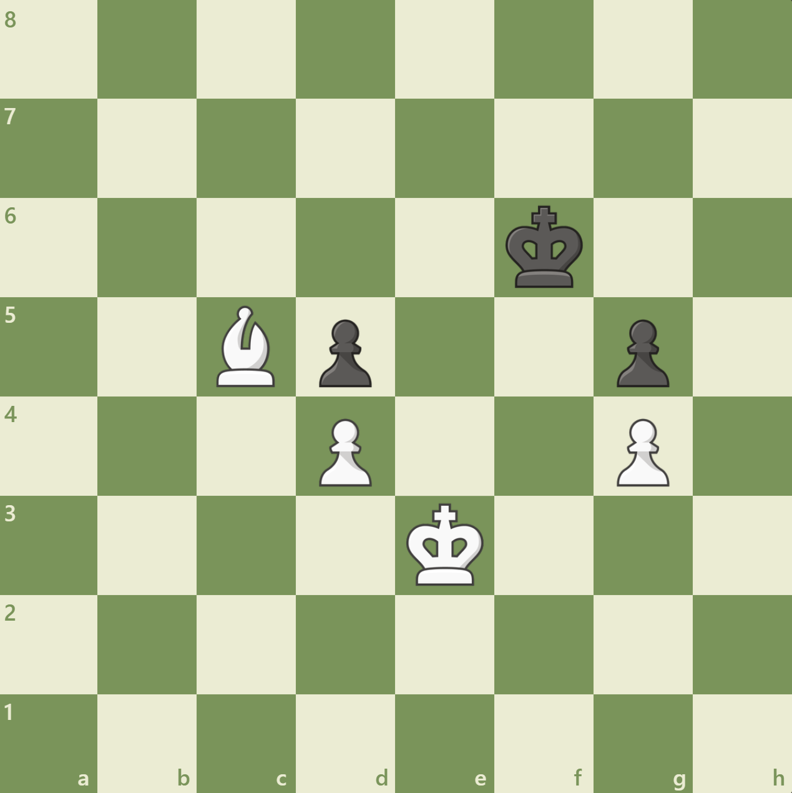

# Chesssir

[](https://github.com/OliW07/ChesssirEngine/actions/workflows/build.yml)


### High Performance C++20 Chess Engine

A UCI compatible chess engine built with a focus on low latency algorithms with a modern, sleek design. 

---
> Self-taught C++20 in 3 months | Nov 2025 - Jan 2026
## Features

- **1M nodes/second** search performance through bitboard optimization and incremental evaluation
- **170% throughput increase** via transposition tables with Zobrist hashing
- **90% branch reduction** using alpha-beta pruning optimization
- **100% move legality** verified through comprehensive Perft testing
---

## Architecture & Design

1. **Hybrid board representation solution** 
   The core of a chess engine is millions of calculations of moving pieces on an 8 x 8 chessboard. Instead of a naive 8 x 8 array of pieces, the primary board representation uses a series of `uint64_t` allocating one bit per square. 
   - Why: This allows a single CPU operation (e.g., << or &) to perform multiple useful operations, such as generating all the pawn pushes or king attacks. This leverages bit-level parallelism, mimicking  the SIMD (single instruction, multiple data) technique by performing multiple logical operations on all 64 squares simultaneously.
   - Visualisation:
    ```bash 
    White Pawns (0x000000000000FF00)
    8  [ 0  0  0  0  0  0  0  0 ]
    7  [ 0  0  0  0  0  0  0  0 ]
    6  [ 0  0  0  0  0  0  0  0 ]
    5  [ 0  0  0  0  0  0  0  0 ]
    4  [ 0  0  0  0  0  0  0  0 ]
    3  [ 0  0  0  0  0  0  0  0 ]
    2  [ 1  1  1  1  1  1  1  1 ]
    1  [ 0  0  0  0  0  0  0  0 ]
        a  b  c  d  e  f  g  h
    ```
     - Drawbacks of the sole bitboard approach include requiring O(n) operations to search through bits to find the exact locations of pieces, which is essential to move generation (think `for each piece do`), which is why, additionally, the use of [Piece Lists](https://www.chessprogramming.org/Piece-Lists) and [Mailboxes](https://www.chessprogramming.org/Mailbox) are used for board representation. Although three simultaneous representations seems overkill, updating each only ever requires a single operation, and the combination of the three allows any operation/query to <u> always run in constant time </u> this has the draw back of a higher memory usage on the stack, however performance, at the expense of memory is always warranted in a high performance program. Usage example:
         1. Checking whether a square is occupied is now O(1) with the mailbox array; the index of the square directly maps to the piece.
       2.  Iterating each piece is O(pieces) with the piece list, as the fixed-sized array stores each piece currently in the game. As an added performance benefit, the piece list is continuous in memory, and can be padded to each 64-byte cache line as the maximum possible number of pieces on a board can be stored with 56 bytes (allowing for null pieces). Another 8-byte memory trade-off per board state, however, drastically reducing cache misses by looping through each piece is an essential performance boost at high depth searches, so this is definitely warranted.
           
2. **State Management: Zobrist Hashing** 
To handle hashing positions to be stored in the Transposition Table, Zobrist Hashing was implemented, where for each piece, a `uint64_t` is randomly allocated and then XORed together.
- Efficiency: Instead of re-hashing the full board after each move, O(n), the nature of the Zobrist Hash allows a single XOR operation for an O(1) incremental update. This happens whenever a piece moves; we can update only that piece on the hash, instead of rehashing the entire position.
- Impact: This allows the engine to recognise previously searched positions, and save time re-searching, resulting in an average increase of <u> 120% more nodes per second </u> even after the cost of probing the table.
- Drawbacks: The number of possible chess positions is extremely large, much larger than could ever be used to index a hashmap, and a `uint64_t` cannot fully guarantee there are no hash collisions (when two completely different positions happen to give the same hash) however, at roughly 1 in 10<sup>19</sup>, this is statistically insignifcant and thus justifies the huge performance benefits.

3. **Build system & Test-Driven Development**
- Utilising CMake's build configuration ensures seamless building across platforms, and allows a clean, modularized code structure.
- GTest unit testing to ensures that  any changes / further development can never subtly affect other modules. This is vital for a complex project such as a chess engine, as many bugs can easily be introduced, which may stay undetected in the code base. Following the TDD principles, tests are written first, and code after, every piece of code is unit tested, such as move generation using a standardised [Perft](https://www.chessprogramming.org/Perft) test, ensuring the engine can only ever play legal moves.

---

## Performance benchmarks

Performance is measured with a combination of Nodes Per Second (NPS) and the total number of branches required to search.

| Feature | NPS (Before) | NPS (After) | Performance
| ------- | ------------ | ----------- |------------
|Unoptimised search | ~210K | - | Baseline
|Incremental hashing & eval | ~210K | ~260K | 24% increase
| Transposition table | ~260K | ~ 700K | 170% increase
| Principal variation search | ~700K | ~ 890K | 27% increase
| Alpha beta pruning | - | - | ~90% branch reduction

> \*_Note: performance is an estimate, actual performance can vary based on your system_

## Performance Context

**Position FEN:** `8/8/5k2/2Bp2p1/3P2P1/4K3/8/8 w - - 0 1`

<p align="center">
  
</p>

**Engine Logs:**
```bash
id name chesssirEngine 1.0
id author Oliver White
uciok
readyok
info starting thinking
info string Chesssir is calculating...
info depth 1 score cp 355 nodes 13 nps 0 pv e3d2
info depth 2 score cp 315 nodes 66 nps 0 pv e3d2
.
.
.
info depth 23 score cp 1110 nodes 34874102 nps 988130 pv e3d2
info depth 24 score cp 1195 nodes 45548430 nps 958914 pv e3d2
bestmove e3d2
```

In this sample position, the engine is calculating at close to **1M nodes per second**, reaching a depth of 24, and correctly evaluating the move King to D2 as the top move.

> \*_Note: at depths 1 & 2, NPS is 0 due to the few nodes in the timeframe rounding to 0_

--- 

## Verification & Correctness

To ensure the integrity of the move generation in all types of positions, the engine is validated against the standardized **Perft** (Performance Test) benchmarks. This is a test that verifies the number of leaf nodes that can be reached from a given depth, which can be verified against known, correct values.

### Perft Results (Standard Start Position)

| Depth | Result (Chesssir) | Expected | Status |
| :--- | :--- | :--- | :---
| 1 | 20 | 20 | ✅ |
|2 | 400 | 400 | ✅ |
| 3 | 8902 | 8902 | ✅ |
|4 | 197281 | 197281 |  ✅|
|5 | 4865609 |4865609 | ✅|

> **Full verification**: I utilized a suite of "tricky" test positions from [The Chess Programming Wiki](https://www.chessprogramming.org/Perft_Results) at high depths to validate complex edge cases such as en passant, promotions, and castling.

## Development & Learning process

This project was not actually my first attempt at developing a Chess Engine. Between 2022 and 2023, I started my journey of chess programming with a simple (Vanilla) JavaScript project, inspired by Sebastian Lagues [Coding Adventure: Chess](https://www.youtube.com/watch?v=U4ogK0MIzqk). This seemed like a natural development from my simpler predecessor project of solving Tic Tac Toe; little did I know the complexity of the algorithmic design and project management that would be required, leaving me with a finished project with unbelievably poor performance and spaghetti code. Ironically, this project was my first ever C++ project - the way I learned the language in effect - I know all too many who never learn the required depth after getting stuck in "tutorial hell" and can never leave the assistance of beginner sites, etc.

### Learning resources

Some of my top resources for learning C++ include (https://www.learncpp.com/) for general language-specific documentation, as well as (https://cppreference.com/). For chess programming specific queries, [The Chess Programming Wiki](https://www.chessprogramming.org/Perft_Results) was a massive help - even if every developer designs their own engine in a completely unique way, this site really helped with the fundamentals.

### AI usage disclaimer

The core chess engine and algorithmic implementation of this project are entirely original, with no AI assistance. However, Command-line-interface AI has been used in this project to give a unqiue evaluation to key design decisions and help to address code quality. I found this useful to get another perspective to challenge my ideas during this process. However, as the project developed, I found that AI tools were not providing quality answers/insights due to the complexity of this project. As AI tools progressively hallucinated more, requiring a large amount of correction from me, these tools were phased out and replaced with more detailed testing to ensure a bug-free project. Google's AI Overview in search was also utilised for syntax searches, significantly reducing time to search official docs or stackoverflow for simple language-specific queries.

## Building

### Requirements
- CMake 3.10+
- C++20 compiler (GCC 10+, Clang 10+, or MSVC 2019+)

### Quick Start

Clone the repo:
```bash
git clone https://github.com/OliW07/ChesssirEngine.git
cd ChesssirEngine
```

**Linux/macOS:**
```bash
mkdir build && cd build
cmake ..
make -j
./chess_engine
```

**Windows (Visual Studio):**
```bash
mkdir build && cd build
cmake ..
cmake --build . --config Release
Release\chess_engine.exe
```

**Windows (MinGW):**
```bash
mkdir build && cd build
cmake -G "MinGW Makefiles" ..
cmake --build .
chess_engine.exe
```

**Run tests:**
```bash
cd build
ctest --output-on-failure
```

Windows (Visual Studio) requires specifying the config:
```bash
cd build
ctest -C Release --output-on-failure
```

## Upcoming
- **Magic bitboards**: Implementing faster sliding piece move generation
- **Lock free parallel search** using C++20 thread for multi-core high performance
